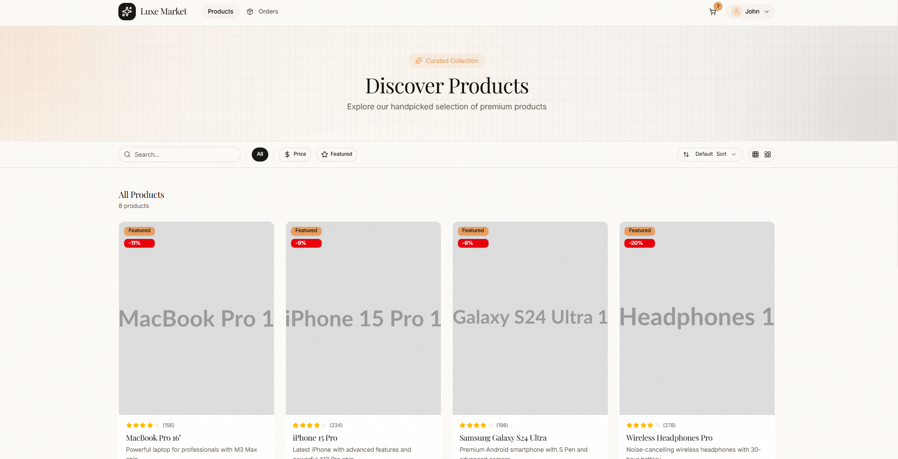
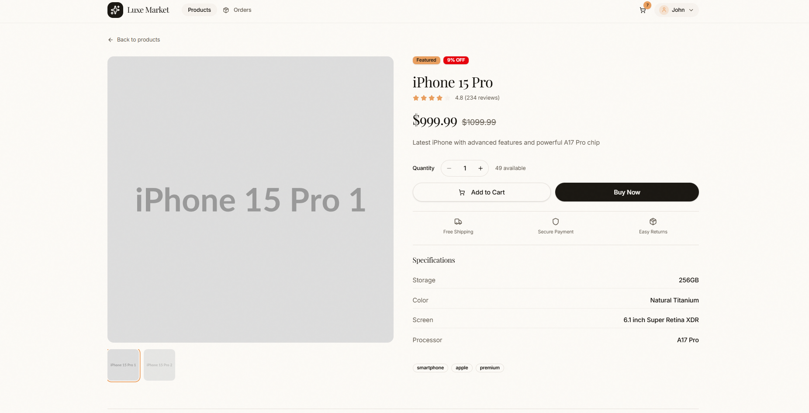
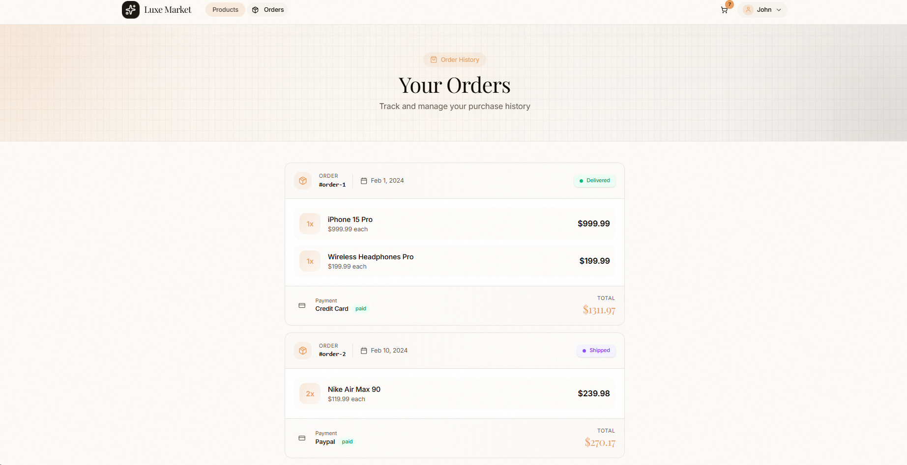

# Luxe Market

A full-stack e-commerce application with a React frontend and Node.js backend.

## Live Demo

- **Frontend:** https://pulsenow-task.vercel.app/
- **Backend API:** https://pulsenow-back.vercel.app/

## Project Structure

```
├── frontend/          # React frontend application
├── backend/           # Node.js backend API
└── README.md          # This file
```

## Quick Start

### Clone the repository

```bash
git clone https://github.com/xerk/pulsenow-task.git
cd pulsenow-task
```

### Backend Setup

```bash
cd backend
pnpm install
pnpm dev
```

The API will be available at `http://localhost:3000`

> For more details, see the [Backend README](./backend/README.md)

### Frontend Setup

```bash
cd frontend
pnpm install
```

Create a `.env` file in the `frontend` directory:

```env
VITE_API_URL=http://localhost:3000/api
```

Start the development server:

```bash
pnpm dev
```

The app will be available at `http://localhost:5173`

### Test Credentials

```
Email: john.doe@example.com
Password: password123
```

---

# Frontend Documentation

A modern e-commerce frontend built with React 19, TypeScript, and Tailwind CSS.

## Screenshots

### Products Page


### Product Detail


### Orders Page


## Tech Stack

- **React 19** - UI library
- **TypeScript** - Type safety
- **Vite** - Build tool
- **Tailwind CSS 4** - Styling
- **React Router 7** - Routing
- **TanStack Query** - Server state management
- **Zustand** - Client state management
- **React Hook Form + Zod** - Form validation
- **Axios** - HTTP client
- **shadcn/ui** - UI components
- **Lucide React** - Icons

## Frontend Project Structure

```
src/
├── assets/          # Static assets (images, fonts)
├── components/
│   ├── cart/        # Cart-related components
│   ├── layout/      # Layout components (Navbar, ProtectedRoute)
│   ├── products/    # Product-related components
│   └── ui/          # shadcn/ui components
├── context/         # React contexts
│   ├── AuthContext.tsx
│   ├── CartContext.tsx
│   └── CartAnimationContext.tsx
├── hooks/           # Custom React hooks
│   ├── use-mobile.ts
│   └── useProducts.ts
├── lib/             # Utility functions
├── pages/           # Page components
│   ├── Checkout.tsx
│   ├── Login.tsx
│   ├── Orders.tsx
│   ├── ProductDetail.tsx
│   ├── Products.tsx
│   └── Profile.tsx
├── schemas/         # Zod validation schemas
│   ├── auth.ts
│   ├── checkout.ts
│   ├── profile.ts
│   └── review.ts
├── services/        # API service layer
│   ├── client.ts    # Axios instance
│   ├── auth.ts
│   ├── cart.ts
│   ├── categories.ts
│   ├── orders.ts
│   ├── products.ts
│   └── reviews.ts
├── store/           # Zustand stores
│   └── authStore.ts
├── types/           # TypeScript types
│   └── index.ts
├── App.tsx          # Main app component
├── main.tsx         # Entry point
└── index.css        # Global styles & CSS variables
```

## Features

### Authentication
- Login with email/password
- JWT token-based authentication
- Protected routes
- Persistent auth state with Zustand

### Products
- Product listing with filters (category, price range, rating)
- Search functionality
- Sort by price/rating
- Responsive grid layout
- Product detail view with image gallery

### Cart
- Add/remove items
- Update quantities
- Persistent cart (synced with backend for authenticated users)
- Cart animations

### Checkout
- Shipping address form
- Payment method selection
- Order summary
- Form validation with Zod

### Orders
- Order history
- Order status tracking
- Order details view

### Reviews
- Product reviews with ratings
- Submit new reviews
- Real-time form validation

### Profile
- View/edit user profile
- Address management

## API Integration

The frontend integrates with a REST API backend. API services are organized by domain:

- `auth.ts` - Authentication (login, profile)
- `products.ts` - Product CRUD operations
- `cart.ts` - Cart operations
- `orders.ts` - Order management
- `categories.ts` - Product categories
- `reviews.ts` - Product reviews

## Form Validation

Forms use React Hook Form with Zod schemas for validation:

- `auth.ts` - Login form validation
- `checkout.ts` - Shipping address validation
- `profile.ts` - Profile form validation
- `review.ts` - Review form validation

## Styling

- CSS variables defined in `index.css` for theming
- oklch color format for better color manipulation
- Responsive design with Tailwind breakpoints
- Dark/light mode support ready

## License

MIT
